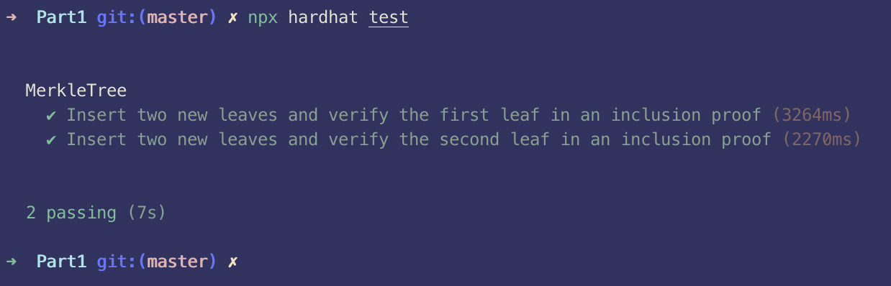
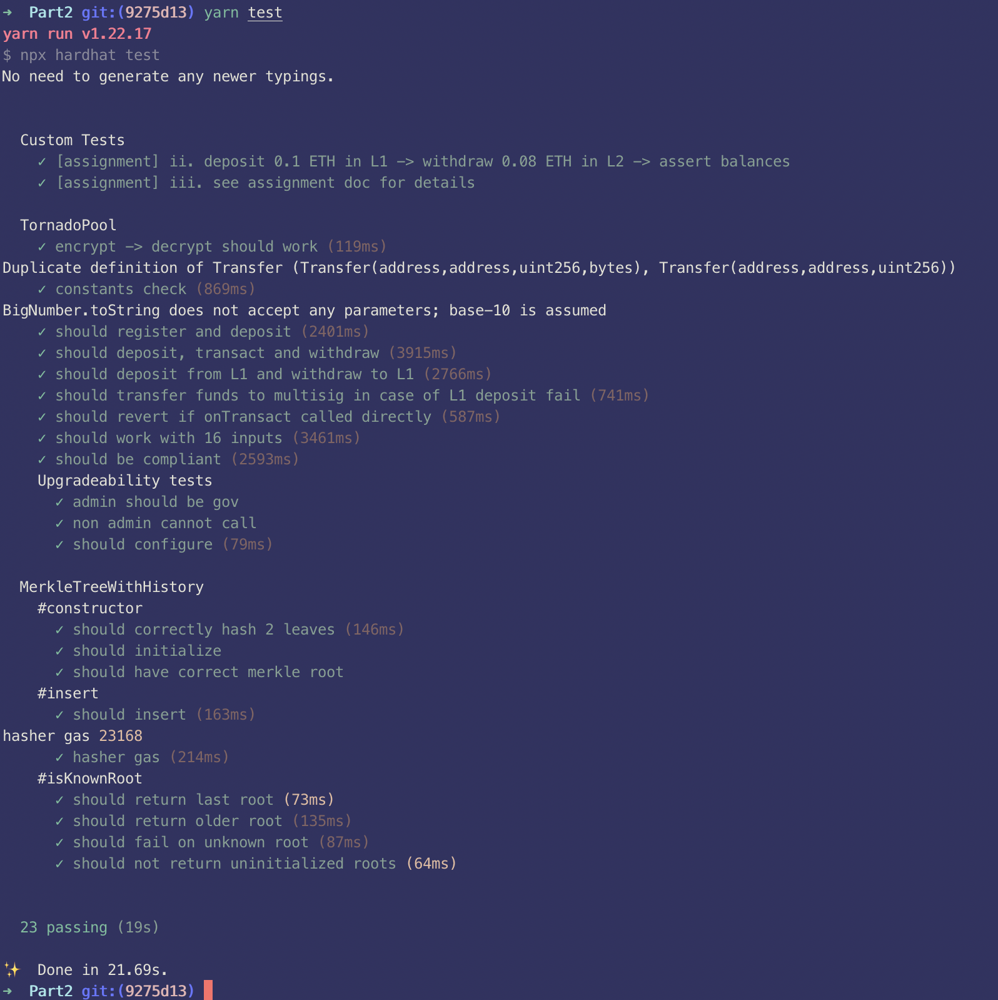

# Part 1 Hashes and Merkle Tree

## Part 1.1

### Gas Cost

Rank:

- SHA256 < Poseidon < MiMC < Pedersen

Explanation:

- In Reference 1 there is a benchmark comparing the gas cost of hashing 2 `uint256` values on-chain - SHA256 uses 23k, Poseidon uses 50k, and MiMC uses 60k gas as per the specified parameters.
- In Reference 2 section 5.4 Optimality, through a review of using Pedersen and Poseidon hashes in the Tornado Cash application, it has been found that Pedersen hash function uses more gas than the Poseidon hash function.
- In Reference 3 it is mentioned that Pedersen hash cannot be efficiently computed on the EVM, which implies that it effectively has "infinite" gas cost.

References:

1. https://ethresear.ch/t/gas-and-circuit-constraint-benchmarks-of-binary-and-quinary-incremental-merkle-trees-using-the-poseidon-hash-function/7446
2. https://tornado.cash/audits/TornadoCash_cryptographic_review_ABDK.pdf
3. https://github.com/clearmatics/zeth/issues/4#issuecomment-484262945

### Capacity

_capacity meaning the number of inputs it can take in circomlib templates_

Rank:

- Poseidon < SHA256 == Pedersen == MiMC

Explanation:

- [Poseidon](https://github.com/iden3/circomlib/blob/master/circuits/poseidon.circom) circuit implementation [declares a variable `N_ROUNDS_P` which is an array of 16 elements](https://github.com/iden3/circomlib/blob/master/circuits/poseidon.circom#L74). This array variable is accessed by another variable `t`, specifically the value of `t-2`. Which means, `t-2` must be bounded between 0 and 15 (15th index is the 16th element in the array), or `2 <= t <= 17`. Given how `t` is declared [here](https://github.com/iden3/circomlib/blob/master/circuits/poseidon.circom#L75), this places bounds on `nInputs` as `1 <= nInputs <= 16`. Hence, the capacity of the Poseidon implementation in circom is at most 16.
- SHA256, MiMC (Sponge) and Pedersen hash circuits all don't have concrete limits on the number of inputs they can take in the circomlib templates, hence all ranked at the same rank since effectively "infinite" number of inputs allowed, which is higher than the finite limit the Poseidon circuit requires.

References:

1. https://github.com/iden3/circomlib/blob/master/circuits/mimcsponge.circom
2. https://github.com/iden3/circomlib/blob/master/circuits/sha256/sha256.circom
3. https://github.com/iden3/circomlib/blob/master/circuits/pedersen.circom
4. https://github.com/iden3/circomlib/blob/master/circuits/poseidon.circom

### Proof generation efficiency

Rank:

- SHA256 (least efficient) < Pedersen < MiMC < Poseidon (most efficient)

Explanation:

- Proof generation efficiency is primarily affected by the number of constraints that need to be generated, but also dependent upon the actual implementation of the circuit itself. There may be many operations that don't generate constraints but take a long time as well.
- Reference 1 compares MiMC Binary and Poseidon Binary, which shows that Poseidon Binary is more efficient.
- Reference 3 has Table 4 which shows benchmark results for number of R1CS constraints for a circuit proving a leaf knowledge in the Merkle tree of 230 elements.
  - SHA-256 has 826020.
  - Pedersen has 41400.
  - Poseidon(-128) has 7290 (for binary tree, or 2:1 arity tree).
  - MiMC has 19440.

References:

1. https://ethresear.ch/t/gas-and-circuit-constraint-benchmarks-of-binary-and-quinary-incremental-merkle-trees-using-the-poseidon-hash-function/7446
2. https://github.com/akosba/xjsnark/issues/24#issuecomment-501069547
3. https://www.usenix.org/system/files/sec21summer_grassi.pdf

### Proof size

Rank:

- SHA256 (biggest) < Pedersen < MiMC < Poseidon (smallest)

Explanation:

- Proof size is related to the proving key size.
- In Reference 1, it is said that `Moreover, the number of constraints required by a zk-SNARK circuit to verify a Merkle proof increases with the tree depth. In turn, this increases proving time, proving key size, and circuit file size.`. In Reference 2, Table 4 which shows benchmark results for number of R1CS constraints for a circuit proving a leaf knowledge in the Merkle tree of 230 elements.
  - SHA-256 has 826020.
  - Pedersen has 41400.
  - Poseidon(-128) has 7290 (for binary tree, or 2:1 arity tree).
  - MiMC has 19440.
- Hence, we rank the hash functions' proof sizes as according to the number of constraints they require to be generated in the circuit.

References:

1. https://ethresear.ch/t/gas-and-circuit-constraint-benchmarks-of-binary-and-quinary-incremental-merkle-trees-using-the-poseidon-hash-function/7446
2. https://www.usenix.org/system/files/sec21summer_grassi.pdf

## Part 1.3

Proof of unit tests passing:

# Part 2 Tornado Cash

## Part 2.1

Here we compare Tornado Cash Nova from Tornado Cash Classic.

### Chains

Classic works natively with the L1 Ethereum mainnet only.

Nova works with both L1 mainnet and L2 Gnosis Chain (formerly xDai chain) under the hood. The reason for this is to leverage L2 Gnosis Chain for cheaper and faster transactions. To facilitate this, a bridge (Omnibridge) is used to bridge between ETH from the mainnet and WETH on the Gnosis Chain. As a result, to prevent spam attacks that will overload the bridge, the withdrawal amount is required to be strictly greater than 0.05 ETH.

### Functionality

Classic only allows users to deposit and withdraw fixed amounts of either 0.1, 1, 10 or 100 ETH.

Nova allows users to deposit and withdraw **any** amounts of ETH.

Additionally, Nova allows users to perform shielded transfer of funds across any shielded addresses within the Tornado Nova anonymity pool. Shielded addresses are addresses that are registered with the Tornado Nova pool.

### Flow Comparison: Deposit -> Withdraw

Classic Deposit -> Withdraw Flow:

1. User send deposit transaction to L1 `ETHTornado` contract containing commitment. ETH funds are held within contract.
2. User interacts with relayer to withdraw funds from L1 contract into users' (new) wallet address. The amount withdrawn will **exactly** match the amount deposited.

Nova Deposit -> Withdraw Flow:

1. User sends deposit transaction to Omnibridge on L1 side, specifically the `L1Helper` contract. If this is the first time this wallet address has interacted with Tornado Nova, this wallet address is registered, thus creating a shielded address for the wallet before funds are deposited into it.
2. Omnibridge, as an [Arbitrary Message Bridge (AMB) extension](https://docs.tokenbridge.net/eth-xdai-amb-bridge/about-the-eth-xdai-amb), uses AMB to bridge ETH over to Gnosis Chain.
3. Once tokens are bridged, interact with the WETH token address send deposited amount of WETH to the Tornado Pool L2 contract address.
4. User interacts with relayer to withdraw funds. WETH on Gnosis Chain is bridged back over to ETH on mainnet via Omnibridge, then sent to the recipient's wallet address.

### Key Technical Upgrades

With Tornado Cash Classic, users interact directly with L1 smart contracts' `deposit` function to deposit funds, and then interact with relayers to withdraw funds to a (new) address without any pre-existing balance.

To implement Tornado Cash Nova features, additional smart contract functionality had to be implemented to:

- Work with Omnibridge to bridge assets from ETH on mainnet to WETH on Gnosis Chain.
- Register shielded addresses supporting shielded balances.
- Keep track of remaining funds associated with each wallet address in the Tornado pool. This is implemented via the Unspent Transaction Output (UTXO) model. This is especially necesary when users are able to withdraw any arbitrary amount less than or equal to the amount they had deposited initially, giving rise to the need for tracking remaining balances for each wallet address.

## Part 2.2 Relayers

Every transaction sent to interact with a smart contract requires the sender paying some amount of gas, in addition to providing the `calldata`. Should end-users be sending transactions directly to the smart contract themselves, doing so would **not** preserve their privacy as the public would be able to piece together the specific smart contract interaction and the user's wallet address.

Relayers are long-running processes that send transactions on behalf of end-users. They are the ones who pay for the gas required, and receive the transaction `calldata` and destination (`to`) smart contract address from the users. Users can easily generate transaction `calldata` by simply signing messages without needing to pay for any gas at all, and then making network calls to pass along this `calldata` hash to the right relayer. With relayers, users can continue to interact with smart contracts while preserving the privacy of their wallet address, and hence identity.

Specifically for the Tornado Cash application, users interact with relayers during the fund withdrawal process to withdraw funds into a brand new wallet with no pre-existing balance (since relayers pay for gas instead of users). Each time a withdrawal is issued by a user, relayers have to pay the Tornado Pool fee in the TORN token as the `StakingReward` contract deducts from the relayer's staked balance. This fee is stored in the `StakingReward` contract and is redistributed to any TORN token holder who has locked in their TORN in the `Governance` contract. Users pay for the fund depositing process, though.

## Part 2.3

Passing tests after building submodule:

# Part 3 Semaphore

## Part 3.1

Semaphore is a set of tools that allow users to 1) prove their membership in a set without revealing their own identities, and 2) signal their endorsement of any arbitrary string. These tools include Solidity smart contracts and JavaScript libraries to make onchain verification and offchain proof generation easier. (Incremental) Merkle Trees stored on-chain are used for maintaining registered identities, which make it easy to prove set membership - users generate proofs on the client-side using, as private inputs stored locally on their machine, their public key (wallet address), their identity nullifiers and identity trapdoors and provide these proofs along with the siblings along the merkle path to the verifier smart contract. Then, nullifier hashes are used to prevent double signing, as explained below. These contracts are meant to serve as the basis for DApp developers to extend and build their own use cases.

## Part 3.2

Semaphore uses nullifier hashes to prevent double signing. Nullfier hashes are computed as the hash of the following:

- identity nullifier, which is local to the user and they should save it
- external nullifier, which is public, and
- merkle path, which is a list of siblings on the path from the root to the identity commitment at the leaf of the (incremental) merkle tree where it is stored.

Nullifier hashes are stored on-chain [here](https://github.com/semaphore-protocol/semaphore/blob/main/contracts/base/SemaphoreCore.sol#L15) and it is the smart contract that prevents double signing by failing proof verifications where the nullifier hash is already stored / used. Every time a proof is verified, [this mapping is checked to ensure that the nullifier hash **is not already saved on the contract**](https://github.com/semaphore-protocol/semaphore/blob/main/contracts/base/SemaphoreCore.sol#L33). It is the responsibility of DApp developers to call [`_saveNullifierHash`](https://github.com/semaphore-protocol/semaphore/blob/main/contracts/base/SemaphoreCore.sol#L49) after verification to prevent double signalling.

## Part 3.3

### Token Gated Claims

Token gated experiences are web experiences that are exclusive to wallets that own certain ERC20 / ERC721 tokens. These days, token gated experiences are very popular in limiting the availability of claiming digital and physical assets once (eg. IRL merchandise like clothing) to only those who hold certain tokens.

Semaphore can be leveraged to build a use case for token gated claims. In order to do so, we have to prove the following:

- User owns a particular ERC20 / ERC721 token
  - Semaphore allows proving set membership
- Claim is only performed once
  - Semaphore allows preventing double signalling

While doing so, we benefit from keeping private the users' public key (wallet address) and hence the specific tokens that they own.

The smart contract would:

- Register the identity commitment
- Verify the proof
- Store the nullifier hash to prevent double claiming from the same identity.

The circom circuit would:

- Take in private inputs
- Take in public inputs such as the merkle root.

### Games: Cards Against Humanity

Cards Against Humanity is a card game where, each round players anonymously place entries that fill in the blanks of a publicly known sentence in an attempt to become the most highly voted entry among the group of players. Read more about the rules [here](https://www.ultraboardgames.com/cards-against-humanity/game-rules.php).

Semaphore can be leveraged to build a use case for this game. In order to do so, we have to prove the following:

- Player is authorized to play the game (after registration)
  - Semaphore allows proving set membership
- In each round, each player can only place one entry
  - Semaphore allows preventing double signalling

While doing so, we benefit from keeping private the users' identity and hence the specific entries that they placed.

Note that there needs to be a reveal phase where the authentic user who broadcasted the winning signal is made known publicly in order for the winning points to be attributed to the winning user.

The smart contract would:

- Register the identity commitment
- Verify the proof
- Store the nullifier hash to prevent double placing entries per each round from the same identity.

The circom circuit would:

- Take in private inputs
- Take in public inputs such as the merkle root.
